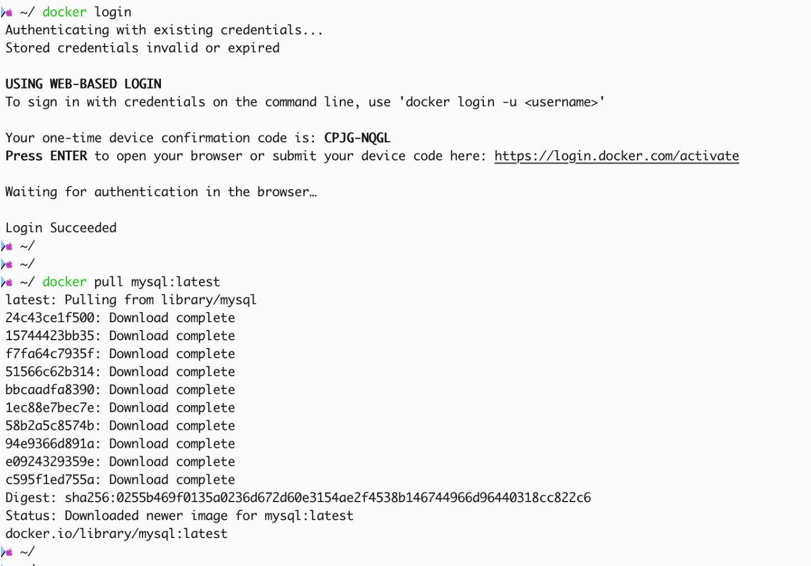

# Docker

### docker login

`docker` 使用`pull images`频次太多可能需要登录，在命令行执行`docker login`并按照指引完成登录即可，如图所示：



### docker command

```bash

docker exec -it $container_id /bin/bash

docker restart $container_id

# docker package
# docker build -t shane-ubuntu:3.0 -f shane-ubuntu.dockerfile .
# docker run -dit -v "C:\Users\admin\Documents\Git Projects\github.com\shanezchang\one-note":/root/one-note shane-ubuntu:3.0
# docker run -dit -v /Users/shanechang/Documents/Code/GitProjects/github.com/shanezchang/one-note:/root/one-note shane-ubuntu:3.0
# docker exec -it c94c3c45bf27299cb09cfd18aa81aa5bf75ff895127e8ef2023aca4a9a81c232 zsh
# docker exec -it 85d73b1f8eab64dc08598e6d6f8f33c2661020dfb9cbbdd0d06ca7299e52af15 zsh
# ctrl + D , exit.


docker run -dit debian:latest
docker run -dit --name debian_demo debian:latest
docker run -dit --name Name -v LocalPath:ContainerPath debian_demo debian:latest


docker run -dit -p 9998:9998 openjdk:latest


# mysql
docker run -dit \
  -p 3306:3306 \
  -p 33060:33060 \
  -e MYSQL_ROOT_PASSWORD=51XWf3FBGs2XVqig \
  -e MYSQL_USER=reader \
  -e MYSQL_PASSWORD=MO672LBIl22dW1AM \
  -v /Users/zhangshuai/Documents/Data/mysql:/var/lib/mysql \
  mysql:latest
2LpYrFBjZ6Ln2jwA
# redis
docker run -dit \
  -p 6379:6379 \
  redis:latest
```


### ubuntu basic demo dockerfile

```dockerfile
# base image
# 基础镜像为最新版本的ubuntu:latest
FROM ubuntu:latest

# config work dir
# 设定工作目录为/root
WORKDIR /root

# apt update
# 更新软件源
RUN apt update && apt upgrade -y

# install chinese package
# 支持中文字符集
RUN apt install -y language-pack-zh-hans \
    && echo "LANG=zh_CN.UTF-8" > /etc/default/locale \
    && echo "LC_ALL=zh_CN.UTF-8" >> /etc/default/locale

# config vim
# 配置VIM
RUN apt install -y vim \
		&& echo "set number" >> ~/.vimrc \
    && echo "syntax on" >> ~/.vimrc \
    && echo "set showmode" >> ~/.vimrc \
    && echo "set encoding=utf-8" >> ~/.vimrc \
    && echo "set autoindent" >> ~/.vimrc \
    && echo "set expandtab" >> ~/.vimrc \
    && echo "set tabstop=4" >> ~/.vimrc \
    && echo "set shiftwidth=4" >> ~/.vimrc \
    && echo "set cursorline" >> ~/.vimrc \
    && echo "set ruler" >> ~/.vimrc \
    && echo "set showmatch" >> ~/.vimrc \
    && echo "set hlsearch" >> ~/.vimrc \
    && echo "set visualbell" >> ~/.vimrc \
    && echo "set autoread" >> ~/.vimrc \
    && echo "set ignorecase" >> ~/.vimrc \
    && echo "set smartcase" >> ~/.vimrc

# config zsh https://github.com/ohmyzsh/ohmyzsh
# 安装并配置ZSH
RUN apt install -y wget zsh git \
		&& sh -c "$(wget -O- https://raw.githubusercontent.com/ohmyzsh/ohmyzsh/master/tools/install.sh)" \
		&& git clone https://github.com/zsh-users/zsh-syntax-highlighting.git ~/.oh-my-zsh/custom/plugins/zsh-syntax-highlighting \
		&& git clone https://github.com/zsh-users/zsh-autosuggestions.git ~/.oh-my-zsh/custom/plugins/zsh-autosuggestions \
		&& git clone https://github.com/zsh-users/zsh-completions.git ~/.oh-my-zsh/custom/plugins/zsh-completions \
		&& sed -i 's/plugins=(git)/plugins=(git zsh-syntax-highlighting zsh-autosuggestions )/' ~/.zshrc \
		&& sed -i 's/robbyrussell/ys/' ~/.zshrc

# config time-zone
# 设置时区为中国/上海
RUN apt install -y tzdata \
    && echo "Asia/Shanghai" > /etc/timezone \
    && ln -sf /usr/share/zoneinfo/Asia/Shanghai /etc/localtime

```


```bash
# name file
# 例如将上述脚本保存为文件，命名为shane-ubuntu.dockerfile

# docker package
# 通过以下命令打包镜像
docker build -t shane-ubuntu:1.0 -f shane-ubuntu.dockerfile .

# run a image container
# 后台启动一个容器
docker run -dit ${ImageNAME}:${TAG}
docker run -dit shane-ubuntu:1.0
```

